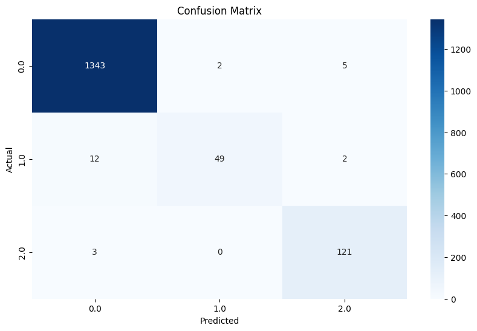

# Thyroid Disease Detection

## Overview
Thyroid disease is a prevalent medical condition characterized by abnormalities in thyroid hormone levels, which regulate the body's metabolism. This project aims to predict whether a patient is at risk for thyroid disease using a **Random Forest Classifier**, with the goal of improving early diagnosis and treatment.

### Key Features:
- Predicts the likelihood of thyroid disease (Normal, Hyperthyroidism, or Hypothyroidism).
- Built using a Kaggle dataset.
- High-performance model with metrics demonstrating excellent accuracy.
- Deployed as a web application using **Streamlit**.

[Live App Link](https://thyroid-disease-detection.streamlit.app/)

## Dataset
- **Source**: [Kaggle Thyroid Disease Dataset](https://www.kaggle.com/datasets/faizunnabi/thyroid-disease-dataset).
- **Features**:
  - Various medical attributes related to thyroid function and patient history.
  - Target: Classification into one of three classes: Normal (0), Hyperthyroidism (1), Hypothyroidism (2).

## Model Implementation
The project uses the **Random Forest Classifier** to predict thyroid conditions. Key steps include:
1. **Data Preprocessing**:
   - Handling missing values.
   - Encoding categorical variables.
   - Scaling numerical features.
2. **Feature Selection**:
   - Selected features based on importance to the model.
3. **Model Training**:
   - Used a Random Forest Classifier with hyperparameter tuning.
4. **Evaluation**:
   - Evaluated model using various performance metrics.

## Performance Metrics
The model achieved exceptional results:

- **Accuracy**: 98.44%
- **Precision (weighted)**: 98.43%
- **Recall (weighted)**: 98.44%
- **F1 Score (weighted)**: 98.39%
- **ROC-AUC Score**: 99.84%

### Classification Report:
| Class               | Precision | Recall | F1-Score | Support |
|---------------------|-----------|--------|----------|---------|
| Normal (0)          | 99%       | 99%    | 99%      | 1350    |
| Hyperthyroidism (1) | 96%       | 78%    | 86%      | 63      |
| Hypothyroidism (2)  | 95%       | 98%    | 96%      | 124     |

### Confusion Matrix:


## Deployment
The model is deployed as a **Streamlit** web application. Users can upload patient data in CSV format and get predictions directly on the web.

### How to Use:
1. Visit the [deployed app](https://thyroid-disease-detection.streamlit.app/).
2. Upload a CSV file containing patient data.
3. View predictions and insights instantly.

## Future Improvements
1. **Enhancing Recall for Hyperthyroidism**:
   - Employ techniques like SMOTE or ADASYN to balance the dataset.
   - Fine-tune hyperparameters for better recall.
2. **Model Explainability**:
   - Integrate SHAP or LIME for better interpretability of feature importance.
3. **Additional Features**:
   - Incorporate more patient demographics and medical history.

## Getting Started Locally
### Prerequisites:
- Python 3.7+
- Required libraries (install using `requirements.txt`):
  ```bash
  pip install -r requirements.txt

### Run Locally:
1. Clone the repository:
   ```bash
   git clone https://github.com/vivekd16/Thyroid-Disease-Detection.git

2. Navigate to the project directory:
   ```bash
   cd Thyroid-Disease-Detection

3. Start the Streamlit app:
   ```bash
    streamlit run app.py

## Repository Structure
    └── Thyroid-Disease-Detection/
        ├── README.md
        ├── LICENSE
        ├── app.py
        ├── requirements.txt
        ├── dataset/
        │   ├── processed/
        │   │   └── ProcessedthyroidDF.csv
        │   └── raw/
        │       └── thyroidDF.csv
        ├── model/
        │   └── thyroid_disease_model.pkl
        └── sources/
            └── thyroid_disease_detection.ipynb

## Authors
- [Vivek Deshmukh](https://github.com/vivekd16) 
- [Linkedin](https://www.linkedin.com/in/vivek-deshmukh-66845822b/)
- [Maviya Mahagami](https://github.com/Maviya13)
- [Linkedin](https://www.linkedin.com/in/maviyamahagami/)

## Acknowledgments
- [Kaggle Thyroid Disease Dataset](https://www.kaggle.com/datasets/faizunnabi/thyroid-disease-dataset)